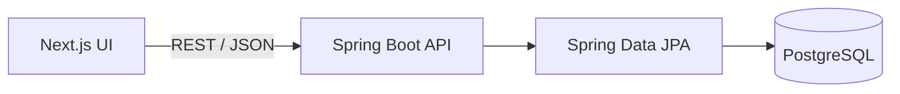

# StratoSpend

> See every cloud resource. Control every cloud cost.

StratoSpend is a multi-cloud resource inventory and cost management application built with Spring Boot, Next.js and PostgreSQL.

The project follows a product-first approach: application features are implemented one vertical milestone at a time before the repository evolves into a complete DevSecOps platform with automated delivery, security scanning, Kubernetes, GitOps and observability.

> **Project status:** Milestone 1 is complete. StratoSpend currently manages cloud account metadata; it does not connect to real cloud providers or collect credentials.

## Current milestone — Foundation and cloud accounts

- Spring Boot REST API and Next.js web application foundations
- PostgreSQL schema versioning with Flyway
- Cloud account registration, listing, lookup and update
- Account activation and deactivation without destructive deletion
- AWS, Azure and GCP provider model
- Development, staging and production environments
- Request validation and consistent API error responses
- Responsive interface with loading, empty and error states
- Backend API tests and frontend component tests

## Technology stack

| Area | Technology |
| --- | --- |
| Frontend | Next.js 16, React 19, TypeScript |
| Backend | Java 17, Spring Boot 3.5, Spring Web, Spring Data JPA |
| Database | PostgreSQL 17, Flyway |
| Testing | JUnit, Spring Boot Test, H2, Vitest, Testing Library |
| Local infrastructure | Docker Compose |

## Architecture



The backend uses a package-by-layer architecture:

```text
dev.sami.platform/
├── model/          JPA entities and domain enums
├── repository/     Persistence interfaces
├── service/        Business rules and use cases
├── controller/     REST endpoints
├── dto/            API request and response contracts
├── exception/      Domain exceptions
└── common/         Shared exception handling
```

Request and response DTOs keep the persistence model separate from the public API contract.

## Repository structure

```text
stratospend/
├── backend/        Spring Boot REST API
├── frontend/       Next.js web application
├── docs/           Architecture decisions and product roadmap
├── compose.yaml    Local PostgreSQL service
├── .env.example    Example local configuration
└── Makefile        Common development commands
```

## Run locally

### Prerequisites

- Java 17 or newer
- Maven 3.9 or newer
- Node.js 24 and npm
- Docker Desktop with Linux containers enabled

### 1. Clone the repository

```bash
git clone https://github.com/sami3l/stratospend.git
cd stratospend
```

### 2. Start PostgreSQL

Copy the example environment file:

```bash
cp .env.example .env
docker compose up -d database
```

PowerShell alternative:

```powershell
Copy-Item .env.example .env
docker compose up -d database
```

The default database configuration is:

```text
Database: cloudcost
Username: cloudcost
Password: cloudcost-local
Host port: 5432
```

If port `5432` is already in use, expose PostgreSQL on another host port such as `5433` and start the backend with:

```text
DB_URL=jdbc:postgresql://localhost:5433/cloudcost
DB_USERNAME=cloudcost
DB_PASSWORD=cloudcost-local
```

When running from IntelliJ IDEA, add these values to the application's **Run/Debug Configuration**. A local `.env` file is not loaded automatically by Spring Boot.

### 3. Start the backend

```bash
cd backend
mvn spring-boot:run
```

The API starts at <http://localhost:8080>.

### 4. Start the frontend

Open another terminal:

```bash
cd frontend
npm install
npm run dev
```

Open <http://localhost:3000>.

## API endpoints

Base path: `/api/v1/cloud-accounts`

| Method | Endpoint | Description |
| --- | --- | --- |
| `GET` | `/api/v1/cloud-accounts` | List all cloud accounts |
| `GET` | `/api/v1/cloud-accounts/{id}` | Get an account by ID |
| `POST` | `/api/v1/cloud-accounts` | Register an account |
| `PUT` | `/api/v1/cloud-accounts/{id}` | Update account details |
| `PATCH` | `/api/v1/cloud-accounts/{id}/status?active={boolean}` | Activate or deactivate an account |

Example request:

```bash
curl -X POST http://localhost:8080/api/v1/cloud-accounts \
  -H "Content-Type: application/json" \
  -d '{
    "name": "development-account",
    "provider": "AWS",
    "externalAccountId": "123456789012",
    "environment": "DEVELOPMENT",
    "region": "eu-west-3"
  }'
```

## Run the tests

Backend tests and coverage report:

```bash
cd backend
mvn verify
```

Frontend linting, tests and production build:

```bash
cd frontend
npm run lint
npm test
npm run build
```

## Security note

StratoSpend stores account identifiers and descriptive metadata only. Do not add cloud access keys, secret keys, tokens or other credentials to account records, environment files or Git history.

## License

This project is licensed under the [MIT License](LICENSE).

## License

This project is licensed under the [MIT License](LICENSE).
