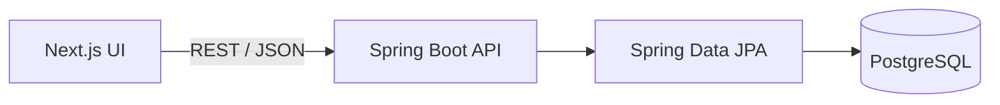

# Application architecture

## Milestone 1



The backend uses a package-by-layer architecture. Request and response DTOs keep the persistence model out of the public API contract.

```text
dev.sami.platform/
├── controller/    REST endpoints and HTTP concerns
├── service/       Use cases and business rules
├── repository/    Spring Data persistence interfaces
├── model/         JPA entities and domain enums
├── dto/           API request and response contracts
├── exception/     Domain exceptions
└── common/        Shared API exception handling
```

## Cloud account rules

1. Providers are limited to AWS, Azure and GCP.
2. Environments are development, staging and production.
3. Provider plus external account ID must be unique.
4. Cloud credentials are never collected in this milestone.
5. Deactivation is used instead of deletion so future cost history remains attached.
6. Provider and external ID cannot be changed after registration; descriptive fields can be updated.

## API

| Method | Endpoint | Purpose |
| --- | --- | --- |
| `GET` | `/api/v1/cloud-accounts` | List accounts |
| `GET` | `/api/v1/cloud-accounts/{id}` | Get one account |
| `POST` | `/api/v1/cloud-accounts` | Register an account |
| `PUT` | `/api/v1/cloud-accounts/{id}` | Update descriptive fields |
| `PATCH` | `/api/v1/cloud-accounts/{id}/status?active=false` | Activate or deactivate |
